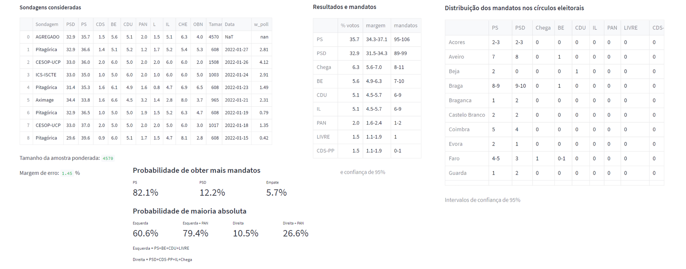
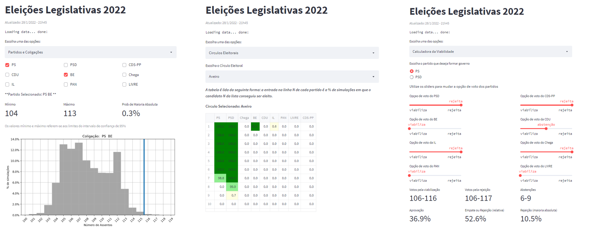

# Portugal: Eleições Legislativas 2024

Link to streamlit app: https://legislativas2024.streamlit.app/

Nesta web app encontram-se algumas análises realizadas nos resultados de 10000 simulações do ato eleitoral. As simulações usam como ponto de partida um agregado das sondagens mais recentes. As sondagens que compõem este agregado são pesadas de acordo com o número de entrevistas e também de acordo com a data em que foi realizada.

A opção *Sondagens e Resultados* apresenta uma tabela com a lista de sondagens utilizadas pelo simulador e também apresenta os resultados globais e a distribuição dos mandatos nos círculos eleitorais

Na opção *Partidos e Coligações* é possível ver em detalhes o resultado de um partido individualmente ou criar coligações hipotéticas.

A opção *Círculos Eleitorais* fornece informação detalhada a respeito da probabilidade de um candidato de uma lista partidária ser eleito no círculo eleitoral em que concorre. Responde perguntas do tipo: "Qual a probabilidade do candidato número 3 da lista do PAN ser eleito no círculo de Lisboa?

Na opção *Calculadora da Viabilidade* pode-se explorar os possíveis cenários de votação na Assembleia da República para viabilizar ou rejeitar o novo governo e, baseado nos resultados das simulações, é obtida uma estimativa para a probabilidade de um governo ser aceito. Há 2 opções de partidos formadores de governo: PS e PSD.

Na opção *Quadro-Resumo* encontra-se as probabilidades de vitória (em termos de número de mandatos do PS e PSD e as probabilidades de maioria absoluta de esquerda e de direita (incluindo ou não o PAN).

#### EN Translation

This web app presents some analysis that I carried out on the results of the simulation of 10000 elections. The simulations use an aggregate of the most recent polls as a starting point. The polls that make up this aggregate are weighted according to the number of interviews and to the date on which they were conducted.

The *Sondagens e Resultados* tab presents a table with the list of polls used by the simulator and also presents the global results and the distribution of seats in the electoral circles

In the *Partidos e Coligaçõess* tab, it is possible to see in detail the result of an individual party or create hypothetical coalitions.

The *Círculos Eleitorais* tab provides detailed information about the likelihood that a candidate on a party list will be elected in the constituency in which they run. It answers queries such as: "What is the probability that candidate number 3 on the PAN list will be elected in the Lisbon constituency?

In the *Calculadora da Viabilidade* tab, it is possible explore the possible voting scenarios in the Assembly of the Republic on a hypothetical motion to reject the new government. There are 2 options for government forming parties: PS and PSD.

The *Quadro Resumo* tab displays the probabilities of victory (in terms of the number of PS and PSD mandates and the probabilities of an absolute majority of the left and the right (including or not the PAN).

#### Screenshots

